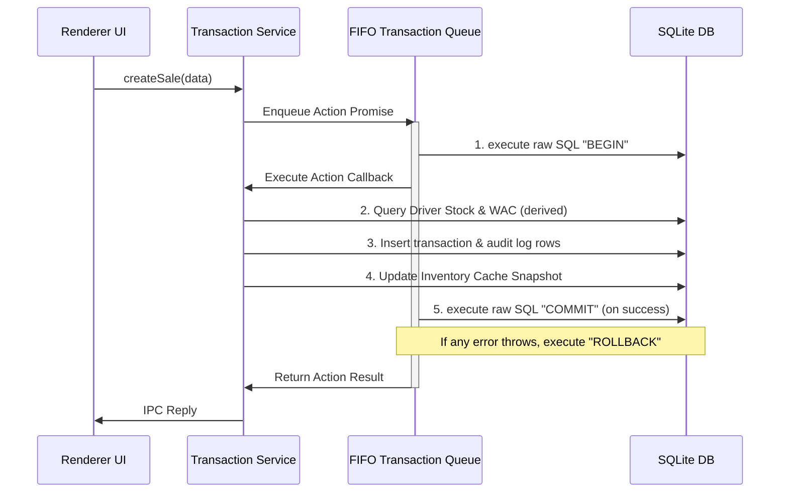

# Diesel Inventory Management System (ERP) - Architecture Documentation

This document explains the core structural design and inventory mechanics implemented in the business domain engine (Phase 2 & Phase 3) and the frontend desktop interface (Phase 4).

---

## 1. Single Source of Truth: The Transaction Ledger

In a typical desktop ERP, keeping data consistent across concurrent modules (purchases, sales, transfers, reports) is a major engineering challenge. Standard CRUD applications often create separate tables for purchases, sales, and transfers. This leads to:
* Duplicated quantity definitions.
* Running inventory balances stored on rows getting out of sync when transactions are backdated or deleted.
* Hard-to-audit inventory histories.

To prevent this, this ERP uses a **Transaction Ledger Architecture**.
* Every single physical movement of diesel (purchase, loading a truck, selling to a customer, stock correction) is represented as a single row in the [transactions](file:///d:/Mujahid/Projects/Malak_Enterprise/src/database/schema/schema.ts#L48-L82) table.
* There are no separate "Purchase" or "Transfer" tables. A purchase is a transaction from a `SUPPLIER` source to an `INVENTORY` destination. A transfer is a transaction from an `INVENTORY` source to a `VEHICLE` destination.
* An entity's balance or stock level is never permanently stored on its own row as a static number. Instead, it is dynamically computed when requested by summing the quantities of the transactions affecting it.

---

## 2. Derived Balances vs. Cached Snapshots

### Why Balances Are Derived
Storing a value like `current_balance` on a customer or `current_stock` on a vehicle creates a data-dependency hazard. If an operator edits a transaction from two weeks ago, every subsequent running balance must be updated. If the software crashes midway, the database falls into an inconsistent state.
* **Derived Balances**: By executing database queries like summing inflows (`destination_id = customer_id`) and subtracting outflows (`source_id = customer_id`), we guarantee mathematical consistency.
* **Database Indexes**: To make derived queries run instantly, we added database indexes on `sourceId`, `destinationId`, and `transactionDate` in SQLite. This ensures sub-millisecond query times even with hundreds of thousands of ledger entries.

### Cache Snapshots
To support fast table views (e.g. displaying a directory of 50 drivers with their current truck fuel levels), the [inventory](file:///d:/Mujahid/Projects/Malak_Enterprise/src/database/schema/schema.ts#L85-L91) snapshot table acts as a **read-through cache**.
* Snapshots are updated atomically when new transactions are written.
* If a snapshot is missing or suspected to be out of sync, the system can rebuild the snapshot by scanning the ledger chronologically.
* Snapshots are never used as the source of truth for business decisions (e.g. checking if a truck has fuel before executing a sale). The system always derives stock directly from the ledger to make business checks.

---

## 3. The Weighted Average Cost (WAC) Engine

Diesel fuel is purchased at fluctuating costs from suppliers, mixed in storage tanks, and transferred to delivery trucks. To determine profit margins, we must track the exact cost carrying value of the diesel. This is managed by the **Weighted Average Cost (WAC) Algorithm** in [InventoryService.ts](file:///d:/Mujahid/Projects/Malak_Enterprise/src/database/services/InventoryService.ts).

### The WAC Formula
Every time fuel is added via a Purchase or Opening Balance, the WAC is recalculated:
$$\text{New WAC} = \frac{\text{Prior Stock} \times \text{Prior WAC} + \text{Inflow Quantity} \times \text{Inflow Unit Cost}}{\text{Prior Stock} + \text{Inflow Quantity}}$$

### Operational Rules
1. **Purchases**: Recalculate WAC for the destination tank.
2. **Transfers**: Do not modify WAC at the source. The fuel is moved carrying the source's current WAC. When it arrives at the destination vehicle/tank, the destination's WAC is recalculated using the carried WAC as the inflow cost.
3. **Sales**: Fuel is sold from the truck carrying the truck's current WAC. The cost of goods sold (COGS) is snapshotted as `averageCostSnapshot`, and the profit is recorded immediately on the transaction row:
$$\text{Profit} = \text{Quantity} \times (\text{Selling Rate} - \text{Carried WAC})$$
This ensures that we can compute historical profits instantly without retroactively traversing the graph.

---

## 4. Atomic Asynchronous FIFO Transactions

Since the database driver (`better-sqlite3`) is synchronous, its native transaction method throws a TypeError if async routines or promises are executed within its callback. 

To resolve this while preserving async/await calls across repository boundaries, we implemented an **Asynchronous FIFO Transaction Queue (`runInTransaction`)** in `db.ts`:



This guarantees 100% database write atomicity, completely preventing partial updates or interleaving concurrent writes on the single-user SQLite database.

---

## 5. Sequential Numbering Engine

To generate transaction numbers such as `PUR-000001` or `SAL-000001` without race conditions:
* Sequential generation logic runs inside the `runInTransaction` atomic block.
* The system queries the database for the highest active transaction number of that type (ignoring soft-deleted records).
* The numeric suffix is parsed, incremented, left-padded to 6 digits, and combined with the prefix.
* Concurrent operations are blocked from reading or writing the same sequence due to the transaction-level lock.

---

## 6. Reversible Soft Deletes & Recalculations

Deleting transactions (e.g., incorrect entry) in our ledger-centric system is handled via reversible **soft deletes**:
* **Soft Delete**: Sets `deletedAt = currentTimestamp`.
* **Restoration**: Sets `deletedAt = null`.
* **Rebuild Mechanics**: The soft delete (or restore) operation triggers an automated, transaction-isolated rebuild of the cached inventory snapshots for all locations affected by that transaction. Subsequent stock, WAC, and balance queries ignore all transactions where `deletedAt` is populated.

---

## 7. Desktop UI & Shell Architecture

The user interface is built to reflect professional Light-Themed ERP software, optimized for rapid, keyboard-first operations:

* **Desktop Shell**: Consists of a collapsible navigation sidebar, a status topbar (complete with database link checks and live tick clock), and a max-width centered router viewport container.
* **Component Library**: Includes lightweight wrappers for Buttons, Inputs, Number fields, Textareas, custom Select dropdowns, and Comboboxes.
* **Portal Viewports**: The shell integrates floating overlays at the bottom of the stack to handle global alert prompts (DialogContainer), active notification queues (ToastContainer), and command searches (SearchDialog) without causing re-renders in sub-pages.

---

## 8. Excel-like Reusable Data Grid

The [DataGrid](file:///d:/Mujahid/Projects/Malak_Enterprise/src/components/ui/DataGrid.tsx) acts as the main interface for displaying and editing large tabular records:

```
Focused State ──► Grid Focus Tracking { rowIndex, colIndex }
                     │
    ┌────────────────┴────────────────┐
    ▼                                 ▼
Keyboard Navigation              Cell Editing
- Arrow Keys: Move Focus         - Enter/F2: Toggle Input
- Tab: Shift Focus Right         - Esc: Discard Edits
- Shift+Tab: Shift Focus Left    - Enter (edit mode): Commit & Down
```

* **Clipboard Support**: Selected lines are serialized into Tab-Separated Values (TSV) on `Ctrl+C`, making copy-pasting between the ERP and Microsoft Excel seamless.
* **Resizing & Sorting**: Column headers feature mouse-draggable dividers and sorting indicators.
* **Sticky Columns**: Configurable freeze-panes keep the first index column in place during horizontal scrolling.

---

## 9. Keyboard Shortcuts & Event Broadcasting

To support keyboard-only entry flows, the [ShortcutProvider](file:///d:/Mujahid/Projects/Malak_Enterprise/src/components/ui/ShortcutProvider.tsx) hooks window keydown listeners globally:

* **System hotkeys**:
  * `Ctrl+F`: Global lookup dialog.
  * `Ctrl+N`: New entry (delegates event `'app-shortcut-new'`).
  * `Ctrl+S`: Save form (delegates event `'app-shortcut-save'`).
  * `Ctrl+R`: Refresh view (delegates event `'app-shortcut-refresh'`).
  * `Ctrl+E`: Export table (delegates event `'app-shortcut-export'`).
  * `Escape`: Dismiss active overlays.
* **Event Dispatching**: Using CustomEvents decouples the global listener from page-level states. Feature screens bind to these event streams via the `useShortcutEffect` react hook.
